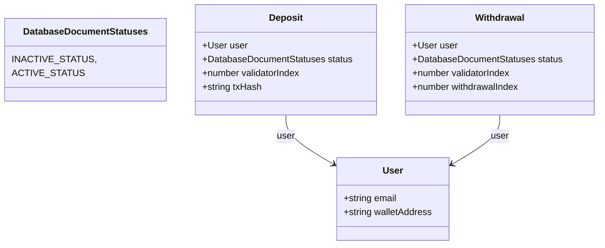

# Database Models

```mermaid

classDiagram
    class DatabaseDocumentStatuses {
        INACTIVE_STATUS,
        ACTIVE_STATUS
    }
    class Deposit {
        +User user
        +DatabaseDocumentStatuses status
        +number validatorIndex
        +string txHash
    }

    class Withdrawal {
        +User user
        +DatabaseDocumentStatuses status
        +number validatorIndex
        +number withdrawalIndex
    }

    class User {
        +string email
        +string walletAddress
    }

    Deposit --> User : user
    Withdrawal --> User : user
```
