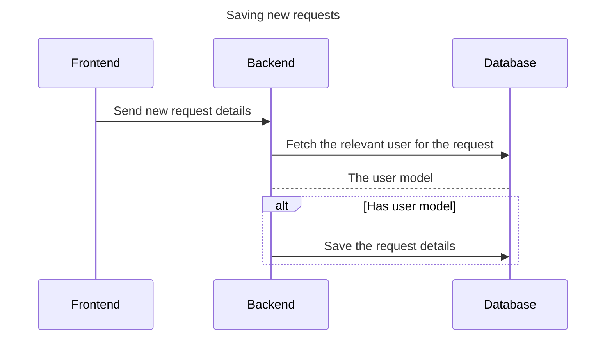
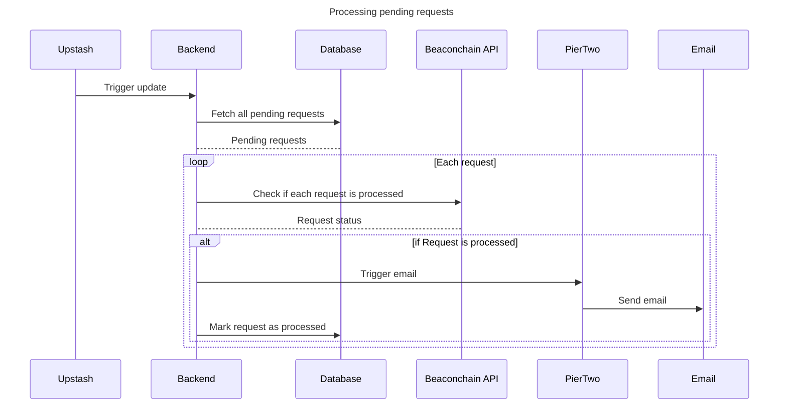

# Emails

Emails in the application allow us to alert the user when a withdrawal, consolidation or deposit is processed on the BeaconChain. Our main source of data for determining this is the beaconcha.in API, unfortunately with this API there are no webhooks which satisfy our needs, so we must call this API on a schedule and check how the pending requests in the app are going and send emails once they are processed.

## General handling for emails

Our generic handling for each request type using Upstash is as follows:

The specifics for how we calculate whether a request is processed varies for each request type.

## Specific handling for request types

### Withdrawals

Sadly to process withdrawal requests we must use a withdrawal index, which is returned apart of the Beacon chain API response. This is made more annoying by the fact that when we send of a withdrawal we don't know what the withdrawal index for that given withdrawal will be.
So to get around this when we store a new withdrawal request we first need to fetch their withdrawals for the given validator from the beacon chain API and store the `lastWithdrawalIndex` for that validator.
Then when we process withdrawals in our webhook we pull all the withdrawals and if we find one with a greater withdrawal index than their `lastWithdrawalIndex` we email them.

#### Shortcomings

This has an obvious shortcoming; if they send multiple withdrawal requests to the same validator before the first is processed they will receive all the emails for all the withdrawal requests when the first one is processed. But given this is pretty unlikely, it doesn't seem like a major issue.

### Deposits

To handle processing deposits we can rely on the transaction hash for a given deposit, this is included in the beacon chain response so we can simply filter for a returned transaction hash that matches a Withdrawal database document.

### Consolidations

TODO
